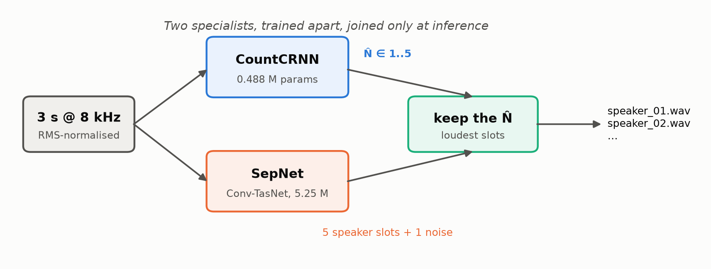
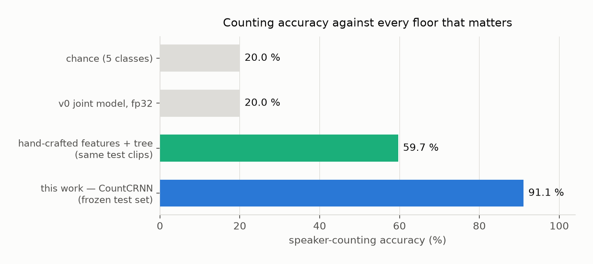
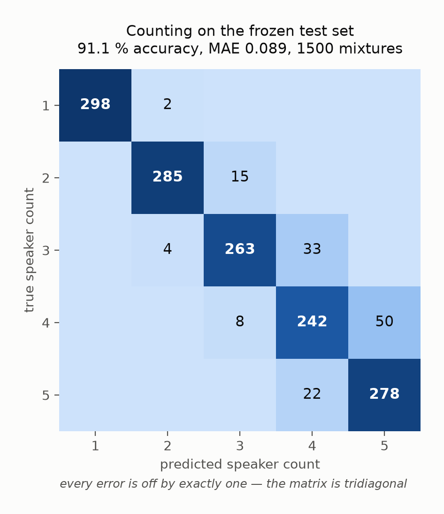
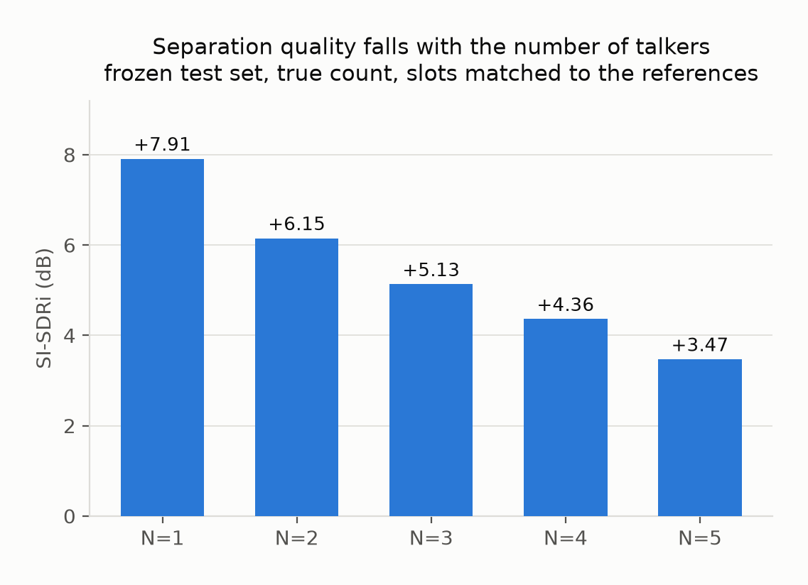
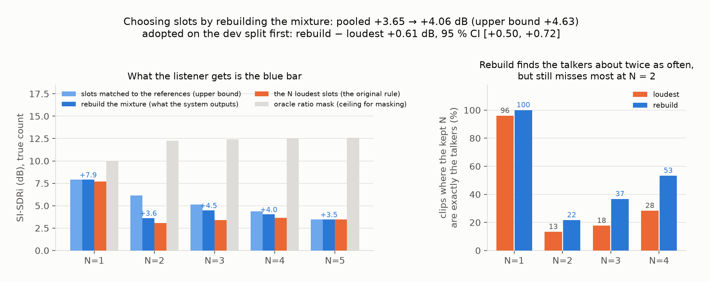
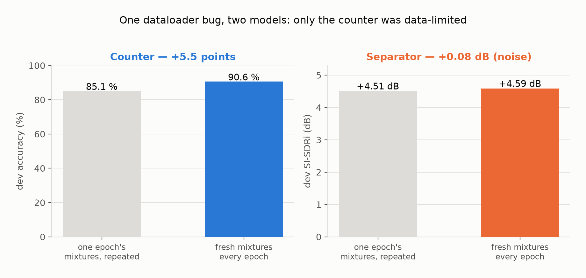
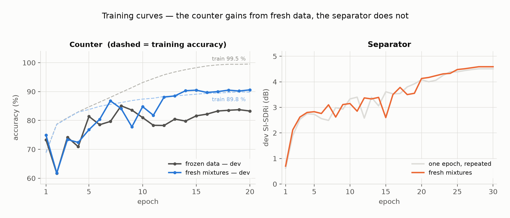
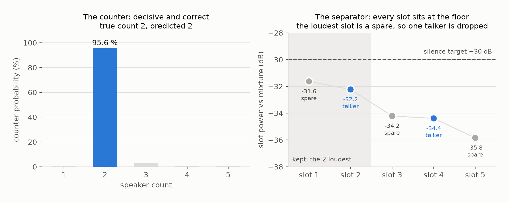
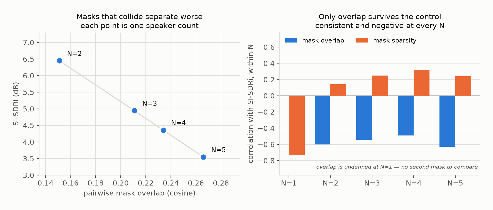
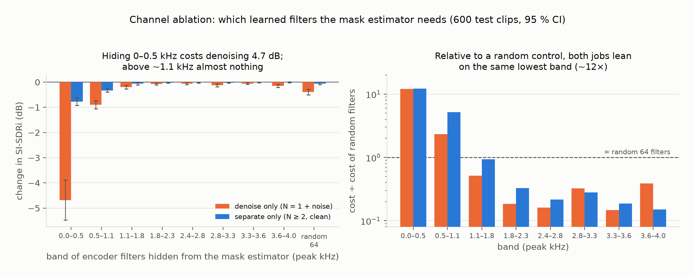

<!-- Edited this file? Rebuild the PDF copy too: python tools/build_overview_pdf.py -->
# What this project does — a guide for the team

Read this first. It takes about five minutes and assumes you have not seen any of the code.

---

## The problem

Give the system **3 seconds of audio in which several people are all talking at the same time**.
It has to do two things:

1. **Count** how many people are talking (between 1 and 5).
2. **Separate** them — output one clean audio track per person.

Everyone talks for the whole 3 seconds. Nobody takes turns. That makes it harder than it sounds,
and it is worth knowing that this is *not* the same problem as figuring out who speaks when in a
normal conversation (that is called diarisation, and it is a different task).

---

## Where the audio comes from

**LibriSpeech**, a public dataset of people reading audiobooks, packaged as **LibriMix**. We take
single-person recordings and add them together ourselves to build mixtures, so we always know the
true answer.

The one rule that matters: **the people in the test set never appear in training.** 201 speakers
for training, 32 for tuning, 32 for the final test, with zero overlap. If a speaker appeared in
both, the system could recognise voices instead of counting them and our scores would be fiction.

We also add background noise (white/pink/brown) to 75% of clips and vary the volume slightly, so
the system cannot cheat by listening for "how loud is it".

---

## The design: two models, not one

This is the single most important thing to understand, and it is the reason this version exists.

**The previous version used one network to do both jobs.** It did neither well. When we measured
where the training signal actually went, the counting half was receiving **0.53%** of it and the
separation half was taking 86% — a ratio of about **633 to 1**. The counting half never learned
anything. It ended up answering **"1 speaker"** to almost every clip, which scores **20%** on a
5-class problem. That is exactly what you would get by guessing.

**So this version uses two separate models**, trained independently and only joined at the end:

```
                    ┌─────────────────────────┐
  3 s of audio  ────┤ Counter  (0.49M params) ├──►  "3 people"
        │           └─────────────────────────┘
        │           ┌─────────────────────────┐
        └───────────┤ Separator (5.25M params)├──►  5 audio slots + 1 noise slot
                    └─────────────────────────┘
                                                        │
                     keep the 3 that rebuild the mix ───┘  ──►  3 clean tracks
```

Each model now gets 100% of its own training signal. It costs about 5% more computing power.
Counting went from **20% to 91%**.



---

## The results

Measured once, at the end, on 1,500 mixtures the models had never seen, from 32 speakers who
were never in training.

### Counting: **91.1% correct**

| | |
|---|---|
| Our system | **91.1%** |
| Guessing | 20.0% |
| The old single-network version | 20.0% |
| A simple decision tree on hand-made measurements, on the same 1,500 test clips | 59.7% |

Note: the tree was first checked by cross-validation on the training speakers (57.8%). The
59.7% above is the fair comparison: the same 1,500 test clips our system was scored on. On those
clips our system is right where the tree is wrong 519 times, and the reverse happens 48 times —
far too lopsided to be luck (a McNemar test puts the chance at about 1 in 10¹⁰⁰).

**The best part is not the 91%.** It is that **every single mistake is off by exactly one.** When
it is wrong, it says 3 when the answer is 4 — never 2, never 5. Out of 1,500 clips there is not
one error bigger than a neighbour. The average error size is **0.089 speakers**, against 2.000 for
the old version.



The grid below shows every one of the 1,500 test clips. Read a row as "the true answer was
this" and a column as "the system said this". Everything sits on the diagonal or right
next to it — nothing lands two squares away.



### Separation: **+4.63 dB** best case, **+4.06 dB** as delivered

"dB improvement" means: how much cleaner each person's voice is after separation than it was in
the mixture. Higher is better; 0 would mean we achieved nothing.

| people talking | improvement |
|---|---|
| 1 | +7.9 dB |
| 2 | +6.2 dB |
| 3 | +5.1 dB |
| 4 | +4.4 dB |
| 5 | +3.5 dB |

More people = harder = smaller improvement. That is expected and it is the right shape.



**Important for the report:** published research reports 14.76 dB, and we should *not* claim we
fell short of it. That number is for a model that is **told** there are exactly 2 speakers, trained
**200 epochs** on **six times more audio**. Ours handles 1–5 speakers, trained 30 epochs, on a free
Kaggle account. Three different things — say so rather than apologising for a gap.

**The +4.63 dB is the best case, and the real number is +4.06 dB.** The separator always makes 5
output tracks, and the system has to choose N of them. To get +4.63 dB, the scoring used the
correct answers to pick which tracks to keep, something the real system can't do. The design
kept the N loudest tracks, and that turned out to be a poor guide. So the system now keeps the N
tracks that, added together, best **rebuild the original mixture**. That needs no retraining.
Scoring the tracks each rule keeps (with the true N given, so miscounting plays no part):

| people talking | answers pick the tracks | keep the loudest (old) | **rebuild the mix (now)** | right tracks kept: loudest → rebuild |
|---|---|---|---|---|
| 1 | +7.9 dB | +7.7 dB | **+7.9 dB** | 96% → 100% of clips |
| 2 | +6.2 dB | +3.1 dB | **+3.6 dB** | 13% → 22% |
| 3 | +5.1 dB | +3.4 dB | **+4.5 dB** | 18% → 37% |
| 4 | +4.4 dB | +3.7 dB | **+4.0 dB** | 28% → 53% |
| 5 | +3.5 dB | +3.5 dB | +3.5 dB | (all 5 kept) |
| **all clips** | **+4.63 dB** | +3.65 dB | **+4.06 dB** | |

We found the rebuild rule *after* seeing the loudest rule fail on the test set, so picking it
because it scored higher there would be tuning on the test set. Before switching, we wrote down a
rule: adopt it only if it also wins on the **dev** set, clips that played no part in designing it.
It did: +0.61 dB better per clip, 95% CI +0.50 to +0.72. **Quote +4.06 dB as what the system
delivers**, +4.63 dB as what it would deliver if it always picked the right tracks, and +3.65 dB
as the original loudest rule. It is not a full fix: with 2 people it still keeps a wrong track in
about 3 clips out of 4.



Two more checks from the same run:

- **Noise type and loudness make almost no difference.** Counting stays between 89% and 93% and
  the separation improvement barely changes across clean, brown, pink and white noise and every
  SNR band we trained on. We never tested recorded noise or SNR below 5 dB.
- **The ceiling is far above us.** A "cheating" method that is given the true voices (an oracle
  mask) reaches about +12.5 dB on the same clips. We reach 38% of that with the right tracks, and
  27% with the tracks we keep.

---

## The most interesting thing we found

Partway through, we discovered a bug in how training data was being fed to the models. Each epoch
was supposed to generate **fresh** mixtures. Because of one wrong setting, it was silently
re-using **the same mixtures every single epoch**.

We fixed it and re-trained both models. The result was not what we expected:

| | before the fix | after the fix |
|---|---|---|
| **Counter** | 85.1% | **90.6%**  (+5.5 points) |
| **Separator** | +4.51 dB | +4.59 dB  (+0.08 dB — nothing) |

**Same bug, same data, same computing time — and it mattered enormously for one model and not at
all for the other.**

The reason: the counter is small and the task is simple enough that it had **memorised** its fixed
set of examples. You can see it in the training curves — its training score climbed to 99.5% while
its real score stalled at 83%. That gap is the memorisation. After the fix the gap disappeared
entirely.

The separator is ten times bigger but its job is to reconstruct audio waveforms, which it cannot
memorise from 12,000 examples. It was never limited by data — it is limited by training time.

This is a genuinely good experimental result: one variable changed, two models, opposite outcomes,
and a measurable explanation for why. **It is worth a section in the report.**



The training curves show *why*. In the left panel the dashed lines are training accuracy. For
the first eight epochs the two runs are identical. Then the broken run (grey) keeps climbing on
its training data — all the way to 99.5% — while its real score stalls. It is memorising
answers instead of learning to count. The fixed run (blue) never does that: its training and
real scores stay together. On the right, the separator's two runs lie almost on top of each
other, which is what "this model was never short of data" looks like.



---

## What it looks like on a single clip

Notebook 05 runs the whole system on one clip and lets you listen. This one is from the test
set, with two people talking:



**Left — the counter.** It puts 95.6% of its confidence on "2", and 2 is correct. That is what
a model that genuinely knows looks like: one tall bar, not a spread.

**Right — something we did not expect.** The separator always produces 5 audio slots, and the
design kept the loudest N. The design assumed the real speakers would be loud and the spare slots
would be pushed down to near-silence, leaving an obvious gap. Instead, **every slot is
near-silent** — all five sit below the −30 dB silence line — and loudness doesn't separate
talkers from spares. On this clip the two talkers are the **2nd and 4th** loudest slots. The
loudest slot is a spare, so "keep the 2 loudest" keeps one talker and one empty slot, and drops
the second talker. (Our first write-up said the two loudest were the talkers, about 2 dB above the
spares. The per-clip scores from the re-run showed that was wrong.) This clip is typical: with
two people talking, the loudest two slots are the right two in only 13% of test clips.

The rebuild rule the system uses now does no better on this particular clip: it keeps two spare
slots. It wins on average, not on every clip; at N = 2 it still misses in about 3 clips out of 4.

The reason is a property of the scoring method. Separation quality is measured with
**SI-SDR**, which is deliberately *scale-invariant*: it judges the *shape* of a sound wave and
ignores how loud it is. Since the model is trained to maximise that score, nothing ever tells
it to get the volume right — and a separate part of training pushes the spare slots quieter.
With a push in one direction and nothing pushing back, everything drifts quiet.

What this means in practice:

- **The accuracy numbers are still correct.** They are scale-invariant too, so they measure
  whether each voice was separated properly, which it was.
- **The raw audio comes out very quiet**, about 30 dB below the input. The demo now boosts the
  separated tracks by a single shared amount so you can hear them, and prints exactly how much.
- **Choosing which slots are real by loudness mostly fails** once there are 2 or more people. That
  cost the drop from +4.63 to +3.65 dB. Choosing by how well the slots rebuild the mixture
  wins back 0.41 dB of that 0.98 dB (+4.06 dB) without retraining. The full fix is a training change we had
  no time for: a loss term that cares about volume, or one that forces the outputs to add back up
  to the input.

---

## Looking inside the separator

Why does separation get worse with more people? We measured how much the separator's internal
"masks" — one per speaker — overlap with each other. More overlap means two speakers are
fighting over the same parts of the sound.



**Left:** as more people talk, the masks overlap more, and separation gets worse — a clean
straight-line relationship.

**Right:** the careful part. Both overlap and quality change with the number of speakers, so a
correlation between them could be a coincidence of that. So we checked *within* each speaker
count separately. Overlap still predicts quality every time (blue bars, all negative). The
other measure we tried, "sparsity", does not — it flips direction once you control for the
number of speakers (orange). We report both.

**Which frequencies does it rely on?** The separator's first layer learns 512 filters, each tuned
to a frequency. We sorted them into 8 bands and hid one band at a time from the part that decides
the masks, then measured how much worse the output got. To be fair, each band was compared with
hiding 64 filters picked at random.



- **Almost everything depends on the lowest band, 0–500 Hz.** Hiding it costs noise removal
  4.7 dB and speaker splitting 0.8 dB, about 12 times what random filters cost. That is where
  voiced speech carries its pitch.
- **Everything above about 1.1 kHz barely matters** to the mask decisions. Hiding any of those
  bands does less harm than random filters, even though they make up three quarters of the filters.
- **We did not find a "noise band" or a "speaker band".** Both jobs lean on the low frequencies by
  the same amount. The 0.5–1.1 kHz band might matter a bit more for splitting speakers than for
  removing noise, but the evidence is not strong enough to claim it.

---

## How to run it

Everything runs on a **free Kaggle account**. Six notebooks, in order. Full instructions with
screenshots-level detail are in **`docs/KAGGLE_RUNBOOK.md`**.

| # | notebook | needs a GPU? | time |
|---|---|---|---|
| 00 | build the dataset | no | 15 min |
| 01 | check for cheating + simple baseline | no | 40 min |
| 02 | train the counter | yes | 2.5 h |
| 03 | train the separator | yes | 9 h |
| 04 | final scoring | yes | 3 min |
| 05 | **demo — listen to it working** | no | 2 min |

Notebooks 00, 01 and 05 use **no GPU time at all**. Kaggle gives 30 GPU-hours a week; the whole
project uses about 11.

**Never edit the `.ipynb` files directly.** Edit `notebooks/src/*.py`, then run
`python tools/build_notebooks.py`. There is an automatic check that refuses to run if you forget.

---

## What is in the repo

```
notebooks/          the six Kaggle notebooks (upload these)
src/countsep/       the actual model and data code
scripts/            one script per stage, called by the notebooks
docs/               KAGGLE_RUNBOOK.md (how to run), DESIGN.md (why), DATA.md, DIAGNOSIS.md
report/             figures for the report + RESULTS.md with every table
tests/              run `python tools/run_all_tests.py` — 8 files, about a minute
```

---

## Six things we must be honest about in the report

These are not weaknesses to hide. Writing them down first is what makes the rest credible, and an
examiner will find them anyway.

**1. Everyone talks at once, the whole time.** Real conversations are mostly people taking turns.
Our system does not handle that and was never trained for it. Say so.

**2. The test set is 1,500 clips but only 32 people.** So the clips are not fully independent. We
report a confidence interval of **89.5% to 92.4%** and should quote that rather than the bare 91.1%.

**3. Half of one interpretability claim failed.** We predicted that as more people talk, the
separator's internal "masks" would overlap more *and* become less sparse. The overlap part held.
The sparsity part did not. We report both. A half-confirmed mechanism honestly reported is worth
more than a fully-confirmed one that nobody checked.

**4. The comparison with published results is not apples-to-apples.** See the separation section.

**5. The system cannot always tell which of its slots hold a speaker.** The separator's outputs
all come out very quiet, and a spare slot is often louder than a real talker. The +4.63 dB score
lets the answer key pick the right slots. Keeping the loudest ones scored +3.65 dB; keeping the
ones that best rebuild the mixture, which the system now does, scores +4.06 dB. With two people
talking it still picks the right two in only about 1 clip in 4.

**6. We changed the dataset and the task from the proposal.** The written proposal already named
Libri2Mix; the proposal presentation said WHAM!, whose download has no speech in it. Counting
was added on top of separation. The noise is computer-generated, not recorded.

The full list, with evidence and what would fix each one, is in
[report/CHANGES_AND_LIMITATIONS.md](report/CHANGES_AND_LIMITATIONS.md).

---

## One-paragraph summary, if someone asks

> We built a system that listens to three seconds of overlapping speech, says how many people are
> talking, and separates their voices. The previous version used a single network for both jobs and
> the counting half scored at chance — we measured that it was receiving half a percent of the
> training signal. We split it into two specialist models. Counting went from 20% to 91%, with every
> remaining error off by only one, and separation improves each voice by about 4.6 dB. Along the way
> we found a data-pipeline bug that had been silently re-using the same training examples every
> epoch; fixing it gained the counter 5.5 points and the separator nothing, which told us which of
> the two was actually short of data.
